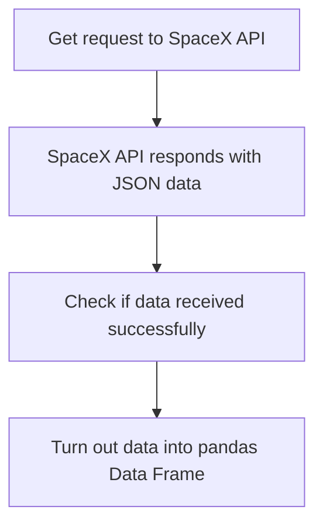
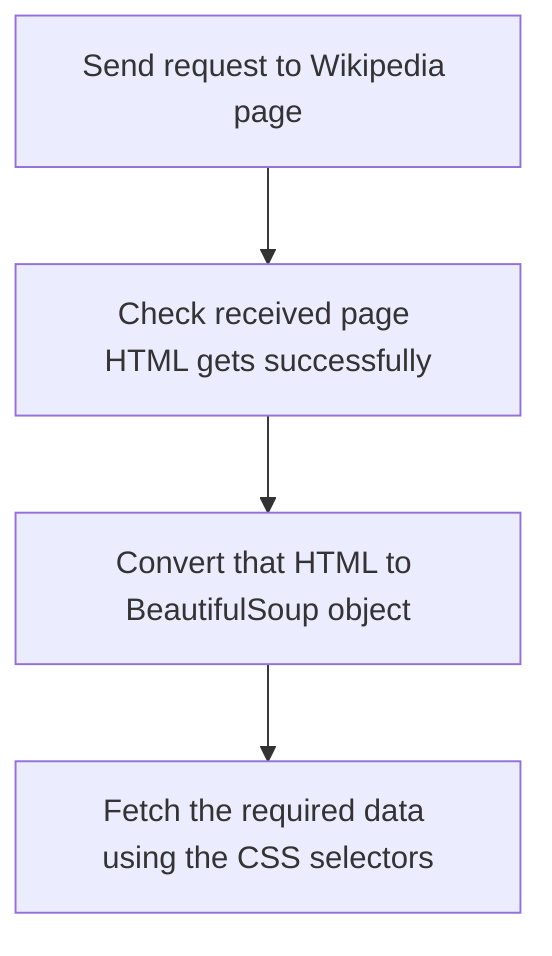

# IBM Data Science Project on SpaceX Dataset
## Project scenario
In this project, I take the role of a data scientist working for a new rocket company. Space Y would like to compete with SpaceX founded by Billionaire industrialist Allon Mask. My job is to determine the price of each launch. I do this by gathering information about Space X and creating dashboards for my team. I also determine if SpaceX will reuse the first stage. Instead of using rocket science to determine if the first stage will land successfully, I train a machine learning model to predict if SpaceX will reuse the first stage.

## Executive Summary
* I’ve to analyze SpaceX Falcon 9 data and predict if it can successfully land the first stage or not. We get this using data analysis, visualization, and using machine learning techniques.
* I’ve found the failure rate and compared them based on the launch sites and different other parameters. We also train machine learning models on data for further predictions.
* I also compare different machine learning models to check which one is best for our data and which of the parameters are best for the performance of the model.

## Introduction
* SpaceX advertises Falcon 9 rocket launches on its website, with a cost of 62 million dollars; other providers cost upward of 165 million dollars each, much of the savings is because SpaceX can reuse the first stage.
* Therefore if we can determine if the first stage will land, we can determine the cost of a launch. This information can be used if an alternate company wants to bid against SpaceX for a rocket launch.

## Methodology
> Executive Summary
* Data collection
* I collect the data using SpaceX API and by scraping Wikipedia pages.
* Perform data wrangling
* O clean the data and remove anomalies from it
* Perform exploratory data analysis (EDA) using visualization and SQL
* Perform interactive visual analytics using Folium and Plotly Dash
* Perform predictive analysis using classification models
* I use built-in libraries to build the model and use Grid Search to get the best parameters
for the model to get maximum accuracy

## Data Collection
* SpaceX provides its API to get the data for processing and analysis. I use this API to get the data and also fetch some data from the Wikipedia pages using web scraping.
* I use requests library for sending the Get request to the API and the BeautifulSoup library for web scraping of the Wikipedia pages to get the data.

### <a href="./jupyter-labs-spacex-data-collection-api.ipynb">Data Collection – SpaceX API</a>

### <a href="./jupyter-labs-webscraping.ipynb">Data Collection - Scraping</a>

## <a href="./labs-jupyter-spacex-Data wrangling.ipynb">Data Wrangling</a>
* I check the missing values in the data and fill them using appropriate methods (median/mode for quantitative data, mode for qualitative data).
* I also make a column with the class which shows the success or failure of the successful landing of the first stage.

## <a href="./jupyter-labs-eda-dataviz.ipynb.jupyterlite.ipynb">EDA with Data Visualization</a>
* I use a scatter plot to show the relationship between variables.
* I also use a bar chart to show the success rate for each orbit.
* I use the line chart to show the success rate yearly.

## <a href="./jupyter-labs-eda-sql-coursera_sqllite.ipynb">EDA with SQL
* I use SQL to get the total payload mass carried by NASA (CRS).
* I also checked the average payload mass carried by booster version F9 v1.1.
* I check the date of the first successful landing outcome.
* I check the total number of successful and failed mission outcomes.
* I display the booster versions which have carried maximum payload mass.

## <a href="./lab_jupyter_launch_site_location.jupyterlite.ipynb">Build an Interactive Map with Folium</a>
* I add the location of NASA Johnson Space Center onto the map.
* Then I mark the location of each launch site on the map.
* Then I’ve to add the success and failure markers on launch sites but as these are on the same coordinates, I use clusters to show these markers effectively.
* I add the mouse position on top of the map to get the current position/location of the pointer.
* Then I add the lines to connect the site to the nearest city, coastline, highway, and railway using the location I get from the mouse position.

## <a href="./Dashboard/dashboard%20code.py">Build a Dashboard with Plotly Dash</a>
* I use the pie chart to show the success rate of the sites on selecting All sites.
* On selecting a single launch site on the dropdown, the ratio of success and failure for that particular site will be shown.
* I use a scatter plot to show the correlation between payload and success rate and give the color of the point according to its booster version.
* Scatter plot shows the correlation for selected sites and for the given range.
* Dashboard screenshot

* All site's pie chart

* Launch site with the highest success

## <a href="./SpaceX_Machine_Learning_Prediction_Part_5.jupyterlite.ipynb">Predictive Analysis (Classification)</a>
* I get the data and standardize it.
* Then I split the data into testing and training data.
* Then I test different models like KNN, SVM, Decision Tree, Logistics Regression, etc. using the Grid Search by passing parameters list.
* I get that the decision tree is best for this as it gives better accuracy than others.

## Results
* In data analysis I found a key point that the success rate is increasing year by year.
* I’ve found through the dashboard that the 6K-8K payload range has the lowest success rates.
* We can see that using Grid Search we can easily get the best parameters for the model and also check the best model by using one by one and better here (For this dataset) is Decision Tree as it is providing the highest accuracy.
* KSC LC-39A has the largest successful launches.
* CCAFS SLC-40 has the highest launch success rate.
* The payload range of 2K-4K has the highest launch success rate.
* F9 booster version, FT has the highest launch success rate.

For a detailed review, you can visit this <a href="./Spacex%20data%20analysis%20and%20modeling%20report.pdf">link</a>.

